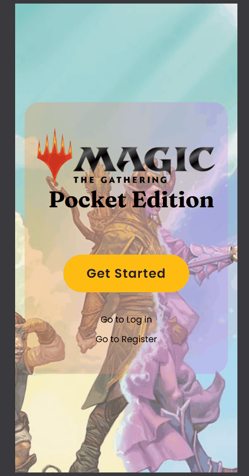

# 🧙‍♂️ MTG Pocket — A Magic: The Gathering Collector App

💻 **Live Demo:** [https://mtgpocket.netlify.app/](https://mtgpocket.netlify.app/)  
📦 **Repository:** [BE](https://github.com/ZoeNguyen73/MTG-Pocket-Express) || [FE](https://github.com/ZoeNguyen73/MTG-Pocket-RN)

---

## 🧭 Overview

**MTG Pocket** is a cross-platform application for **Magic: The Gathering** (MTG) players that allow users **explore different sets, open virtual booster packs, and manage their card collection**.

The project combines my love for MTG with hands-on practice in **full-stack development**, API integration, and cross-platform UI design using a single codebase for **mobile and web**.

---

## 🚀 Features

- 🃏 **Browse MTG sets & cards** with rich card details
- 📦 **Open virtual booster packs** (pack logic based on real MTG rules)
- 🖐️ **Custom card swiper component**
  - Swipe cards left / right
  - Tap to flip or inspect cards
  - Smooth, gesture-driven animations
- 🗂️ **Card collection tracking**
- 🔍 **Sort, filter, favourite cards & view card details** in collection
- 🖼️ **High-quality card images** with responsive layouts
- 🎵 **Background music & sound effects** with persistent playback
- 📱 **Cross-platform support** (mobile & web)
- ⚡ **Fast navigation & smooth animations**

---

## 🧰 Tech Stack

### Frontend

- **React Native (Expo)**: single codebase for mobile & web
- **Expo Router**: front-end navigation
- **NativeWind (Tailwind CSS)**: styling
- **Lottie** and **React Native Animatable**: animations
- **React Native Gesture Handler** — touch & swipe detection
- **Expo Audio**: background music & sound effects
- **Axios**: API requests

### Backend

- **Node.js**
- **Express**
- **MongoDB**
- **RESTful API**
- **Scryfall API**: MTG card data

### Hosting

- **Frontend:** Expo (mobile) / Web deployment to Netlify
- **Backend:** Render

---

## 🧠 Development Process & Key Learnings

MTG Pocket was developed as a **passion-driven full-stack project**, with an emphasis on cross-platform responsiveness and scalability.

Key focus areas:

- Designing a **realistic booster pack opening experience**
- Learning gesture-based UI patterns from scratch
- Managing large external datasets efficiently
- Handling platform differences between mobile and web
- Building reusable, composable UI components
- Creating a visually engaging, game-like experience

---

## 🧩 Technical Highlights & Challenges

| Area                         | Approach / Solution                                                                                                           |
| ---------------------------- | ----------------------------------------------------------------------------------------------------------------------------- |
| **Booster pack logic**       | Implemented rarity-based card selection mirroring real MTG pack distribution.                                                 |
| **External API integration** | Used the Scryfall API for accurate, up-to-date card data.                                                                     |
| **Cross-platform UI**        | One codebase with platform-specific tweaks for desktop web, mobile web, and native.                                           |
| **Background audio**         | Persistent music playback across navigation using Expo Audio.                                                                 |
| **State management**         | Careful handling of async data loading and navigation transitions.                                                            |
| **Mobile-first UX/UI**       | Designed and implemented the app for mobile interactions first, then adapted layouts and interactions for larger web screens. |
| **Custom card swiper**       | Built from scratch using gesture handlers and animated values instead of a library.                                           |

---

## 💡 Lessons Learned

- Cross-platform apps require careful handling of layout and behavior differences
- Large-scale cross-platform requirements make scalable & reusable components essential to the development process
- Real-world logic (like pack collation) adds meaningful complexity
- Polished UX significantly improves perceived app quality
- Testing the apps across different platforms and even different screen sizes is important

---

## 🧪 Future Improvements

- 👤 Social features (friends & card-trading)
- 💰 Real-time price tracking & market value insights
- ⭐ In-app currency that can be used to open packs (i.e. not endless pack opening)
- ☁️ Offline support & caching
- 📊 More accurate pack logic (e.g. more accurate opening rates for ultra rare cards, foil cards, etc)
- 🎴 Support different types of booster packs (play booster & collector booster)

---

## 🧑‍💻 Author

**Zoe Nguyen** — Aspiring Full-Stack Developer  
🌐 Portfolio _(coming soon)_  
💼 [LinkedIn](https://www.linkedin.com/in/zoe-nguyen-ndnn/)  
📫 nganguyen0703@gmail.com

---

## 📸 Screenshots

_Desktop Web_

| Pack opening                                              | Collection                                                       | User & Settings                                               |
| --------------------------------------------------------- | ---------------------------------------------------------------- | ------------------------------------------------------------- |
|  |  |  |

_Mobile_

| Pack opening                                                    | Collection                                                          | User & Settings                                                  |
| --------------------------------------------------------------- | ------------------------------------------------------------------- | ---------------------------------------------------------------- |
|  |  |  |

---

### 📈 Summary

MTG Pocket demonstrates my ability to:

- Build a **feature-rich, cross-platform application**
- Translate real-world systems into application logic
- Deliver a polished, interactive user experience
- Combine technical execution with personal passion
